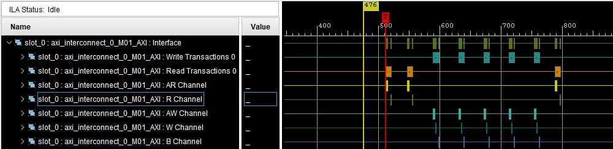
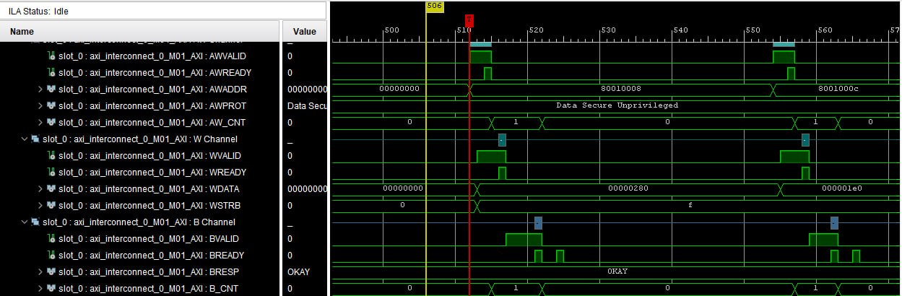
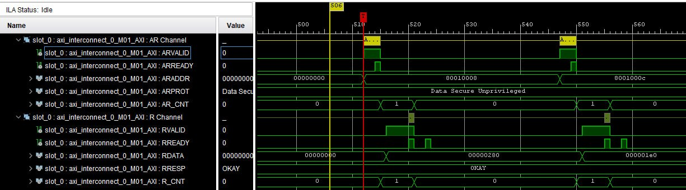

# axi_regs

## Description

Module for creating *AXI-Lite* registers in RTL design.

You can set register values in HDL from **i_external_value signal** (set signal **i_set_external_value** in high).

### Catalogs structure:
- doc - documents;
- sim - .do-files and .sh scripts for Modelsim/Questasim;
- src - source files;
- tb - testbenches;

